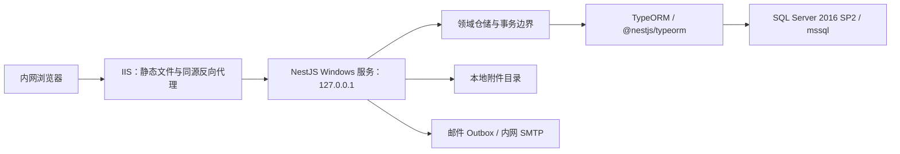

# FlowPilot 正式后端实现设计决策

> 文档状态：已确认的首版实现基线  
> 整理日期：2026-08-24
> 适用范围：NestJS 正式后端、Microsoft SQL Server 2016 SP2、本地附件目录和内网部署

## 1. 文档定位

本文档汇总正式后端实施讨论中已经确认的约束、选择原因和实现建议，用于指导数据库建模、接口实现、附件存储、部署和验收。

- 业务需求以 [`REQUIREMENTS.md`](../REQUIREMENTS.md) 为最高优先级；两者冲突时以需求文档为准。
- REST 接口结构以 [`flowpilot-rest-api.openapi.yaml`](./flowpilot-rest-api.openapi.yaml) 为契约来源。
- SQL Server 表、约束、索引、删除和保留规则以 [`BACKEND_DATABASE_SCHEMA.md`](./BACKEND_DATABASE_SCHEMA.md) 为结构基线。
- 运行参数、认证细节、前端迁移和交付门禁以 [`BACKEND_IMPLEMENTATION_CHECKLIST.md`](./BACKEND_IMPLEMENTATION_CHECKLIST.md) 为开工清单。
- 当前前端 Mock 行为见 [`MOCK_REST_API.md`](./MOCK_REST_API.md)；Mock Bearer 身份、浏览器持久化和模拟任务不能直接搬到生产环境。
- 本文中的逻辑表名和配置键是实施基线，可以在不改变语义和验收结果的前提下调整命名。

## 2. 已确认的总体边界

- 正式后端采用 TypeScript、NestJS 和 REST API，与前端放在同一个 pnpm workspace 中。
- 首版只支持 Microsoft SQL Server 2016 SP2，不实现 SQLite 运行时、数据库 provider 选择或跨数据库切换。
- ORM 固定使用稳定版 TypeORM，通过 `@nestjs/typeorm` 接入 NestJS；MSSQL 底层驱动使用稳定版 npm 包 `mssql`（node-mssql 项目）。连接参数通过部署配置提供，调整目标 SQL Server 实例不需要修改业务代码或重新构建。
- 系统部署在公司内网的 Windows 服务器上：IIS 托管前端静态文件，并把同源 `/api/flowpilot/*` 反向代理到 Windows 服务形式运行的 NestJS。
- 首版只运行一个 API 实例。预计每年新增流程实例不超过 2 万，附件总量不超过 500 GB。
- 附件正文保存在服务器本地目录；数据库只保存元数据、相对存储键和业务引用。
- 当前正式环境使用 HTTP；这是既定兼容条件，但必须明确其缺少传输加密的风险，并保留以后启用 HTTPS 的配置能力。
- 普通用户按账号配置选择 AD/LDAP 域认证或 FlowPilot 本地密码认证，默认使用域认证；系统内置超级管理员始终使用本地密码认证。
- SQL Server 2016 SP2 已超出官方支持周期。兼容它是部署约束，不代表安全推荐；部署方需要提供补偿性控制和升级计划。
- 后端位于 `apps/api`，使用 Node.js 24 LTS x64；具体补丁版本及全部依赖通过仓库版本文件和 pnpm lockfile 锁定。Windows Server 2016 必须在开发开始和每次运行时升级后执行实机冒烟测试。
- 业务时间区固定为 `Asia/Shanghai`，数据库、租约、接口和审计时间统一使用 UTC。



### 2.1 最小依赖基线

正式生产依赖采用白名单管理，并在开始实现时将直接依赖和传递依赖锁定到 `pnpm-lock.yaml`。允许的主要运行时依赖如下：

- NestJS 基础与官方集成：`@nestjs/common`、`@nestjs/core`、`@nestjs/platform-express`、`@nestjs/config`、`@nestjs/typeorm`、`@nestjs/schedule`；
- 数据与配置：`typeorm`、`mssql`、`zod`。`mssql` 只使用默认纯 JavaScript `tedious` 驱动，禁止安装需要 ODBC 和原生二进制的 `msnodesqlv8`；
- 基础设施：`ldapts`、`nodemailer`、`axios`、`pino`、`nestjs-pino`；
- 文件与 HTTP 安全：`busboy`、`file-type`、`yauzl`、`sanitize-html`、`content-disposition`、`helmet`、`cookie-parser`。

`axios` 由基础设施层直接封装，不引入 `@nestjs/axios`。每个已登记的远端服务使用独立客户端实例和配置白名单，必须设置连接/响应超时、最大响应体及受控重试；用户输入不能决定协议、主机、端口或完整 URL，入站 Cookie、Authorization 和内部请求头不得自动透传。当前首版没有已确认的通用公网调用，不能因为已安装 `axios` 而开放任意代理接口。

本地密码使用 Node.js 内置异步 `crypto.scrypt()`，服务端业务标识使用内置 `crypto.randomUUID()`，常规哈希、随机数、路径、文件流和 HTTP 基础能力优先使用 `node:` 模块。生产运行包不引入 `argon2`、`bcrypt`、`uuid`、`fs-extra`、日期工具库、模板引擎、`msnodesqlv8`、Redis/BullMQ、RabbitMQ、Kafka、Passport/JWT、`express-session`、`@nestjs/swagger`、`@nestjs/terminus`、`@nestjs/throttler`、`class-validator`、`class-transformer`、`nestjs-zod`、TypeORM CLS/事务扩展或 SWC 原生加速器。确需新增白名单外依赖时必须先记录用途、替代方案、传递依赖、原生安装脚本和 Windows Server 2016 验证结果。

`@redocly/cli`、`orval`、`@nestjs/cli`、`@nestjs/testing`、Vitest、`supertest`、`smtp-server`、TypeScript 和类型声明只属于开发/测试依赖，不进入生产运行包。所有依赖使用精确版本并冻结 lockfile；服务器不执行无版本约束的安装或升级。

`apps/api` 从创建开始固定为 ESM：包清单设置 `"type": "module"`，TypeScript 设置 `module: "NodeNext"` 与 `moduleResolution: "NodeNext"`。源码使用标准 ESM 导入和 `node:` 内置模块前缀；路径解析使用 `import.meta.url`，不依赖 CommonJS 的 `require`、`__dirname` 或运行目录。TypeORM DataSource、Migration CLI、Vitest、受控维护 CLI、WinSW 启动入口和仅 ESM 的 `file-type` 必须在同一构建模式下验证，不允许生产运行时临时转译或动态修补模块格式。

## 3. 流程定义、版本和动态字段

### 3.1 V1 与 V2 的保存原则

假设流程定义 V1 有属性 A、B、C，V2 有 A、E、F：

- 数据库不为动态业务属性创建 A、B、C、E、F 六个固定物理列。
- V1 保存一份包含 A、B、C 的完整版本快照；V2 另存一份包含 A、E、F 的完整版本快照。
- V2 发布不会覆盖 V1。已经发起的实例永久关联发起时的版本 ID，并继续按 V1 解释和展示。
- 如果 V2 的 A 与 V1 的 A 是同一个业务字段，必须沿用相同的稳定字段 ID；仅修改名称不改变字段 ID。
- 删除字段后重新创建同名字段视为新字段，必须生成新的字段 ID，不能自动映射旧值。
- 流程名称、状态、类型、版本号、发布时间、创建人等稳定且高频查询的系统属性使用普通关系列；动态表单结构和值使用 JSON。

示意：

```json
{
  "version": 1,
  "fields": [
    { "id": "field-a", "name": "A", "type": "text" },
    { "id": "field-b", "name": "B", "type": "number" },
    { "id": "field-c", "name": "C", "type": "date" }
  ]
}
```

```json
{
  "version": 2,
  "fields": [
    { "id": "field-a", "name": "A", "type": "text" },
    { "id": "field-e", "name": "E", "type": "select" },
    { "id": "field-f", "name": "F", "type": "boolean" }
  ]
}
```

### 3.2 推荐的逻辑模型

下列名称用于解释核心流程模型；最终物理表、列、约束、索引和删除行为以 [`BACKEND_DATABASE_SCHEMA.md`](./BACKEND_DATABASE_SCHEMA.md) 为准：

| 逻辑表 | 主要职责 |
| --- | --- |
| `workflow_definitions` | 流程版本家族、名称、类型、当前发布版本指针和状态 |
| `workflow_definition_versions` | 完整、自包含的表单和拓扑 JSON 快照、正式版本号、校验状态、revision |
| `workflow_instances` | 实例公共属性、锁定版本 ID、当前最新表单值 JSON、状态和轮次 |
| `instance_field_values` | 允许查询、排序、列表展示或导出的动态标量字段类型化投影 |
| `workflow_tasks` | 节点任务、轮次、责任人、实际处理人、状态和处理结果 |
| `workflow_events` | 不可变的业务时间线和字段修改元数据 |

每个正式流程版本必须保存完整快照，不能只保存相对上一版本的差异。这样历史实例在当前流程取消发布、字段删除或节点调整后仍可解释。

### 3.3 JSON 与查询投影的组合

所有动态数据只放在 JSON 中，适合完整保存和按版本渲染，但不适合作为全部列表、范围筛选、排序和跨版本统计的唯一查询来源。因此采用“JSON 主数据 + 类型化投影”的组合：

- JSON 是表单结构和实例最新业务值的完整事实来源。
- 只有配置为查询条件、列表字段或 Excel 导出字段的动态标量值进入投影表。
- 投影至少包含流程定义 ID、版本 ID、实例 ID、稳定字段 ID、值类型，以及互斥的文本、数字、日期时间、布尔和选项标识值列。
- 表格字段如果需要按列查询，应保存稳定表格字段 ID、列 ID，并按需要增加行标识；不能把整张表格序列化后再做字符串比较。
- 数字范围使用数字列，日期范围使用日期时间列，布尔和稳定选项标识使用对应类型列，不能统一转成文本后比较。
- JSON 最新值与投影必须在同一个数据库事务中更新。任一部分失败时整体回滚。
- 需要提供幂等的投影校验和重建命令，以 JSON 主数据为来源恢复投影。

推荐索引围绕实际查询建立，例如：

- `(workflow_definition_id, field_id, text_value)`；
- `(workflow_definition_id, field_id, number_value)`；
- `(workflow_definition_id, field_id, datetime_value)`；
- `(instance_id, field_id)` 唯一性或等价约束。

不要为每一个动态字段修改数据库结构，也不要让业务服务拼接动态 JSON 路径 SQL。

### 3.4 历史值和修改记录

- 实例保存当前最新值，历史事件只记录发生修改的稳定字段 ID、当时字段名称、操作人、时间、节点、轮次和说明。
- 不保存、展示或打印字段修改前值、修改后值、旧附件名称和自由协作回复的旧正文。
- 流程定义版本快照属于配置历史，不等同于实例字段修改历史，必须永久保留。

## 4. SQL Server 数据访问与事务

### 4.1 TypeORM 与分层边界

领域服务只能依赖统一接口，例如：

- `PersistenceUnitOfWork`；
- `WorkflowDefinitionRepository`；
- `WorkflowInstanceRepository`；
- `TaskRepository`；
- `AttachmentRepository`；
- `SessionRepository`；
- `OutboxRepository`。

TypeORM 采用 Data Mapper 模式，不使用 Active Record。TypeORM Entity 是数据访问层的持久化模型，与领域实体和 API DTO 分离，三者通过显式 Mapper 转换；领域层不得使用 TypeORM 装饰器。

- 领域服务不得直接导入 TypeORM Repository、`EntityManager`、`QueryRunner`、`DataSource`、`mssql` 连接池或数据库驱动类型。
- 普通单表 CRUD、稳定关联和常规分页查询优先使用 TypeORM Repository 或 QueryBuilder，避免重复手写基础 SQL。
- 编号分配、版本发布、并发任务领取、复杂动态字段投影和带 `UPDLOCK/HOLDLOCK` 的 SQL Server 专用语句，可以在数据访问层通过事务专属 `QueryRunner` 执行参数化原生 SQL，不要求为了形式上的 ORM 纯度改写成低效查询。
- `PersistenceUnitOfWork` 封装 `QueryRunner` 生命周期；事务内仓储只使用该 runner 的 `EntityManager`，禁止混用全局 Repository，确保所有写入位于同一连接和事务。
- 关系级联、实体订阅器和懒加载默认关闭或显式限制，关键领域副作用由领域服务和事务命令明确调用，避免 ORM 隐式写入改变任务、审计或 Outbox 状态。

`{FLOWPILOT_HOME}\Secrets\production.env` 集中保存集成服务和初始化敏感参数，示例模板只提供键名与占位值：

```dotenv
# SQL Server
MSSQL_SERVER=<SQL Server 主机或实例地址>
MSSQL_PORT=1433
MSSQL_DATABASE=<数据库名>
MSSQL_SCHEMA=flowpilot
MSSQL_USER=<应用运行账号>
MSSQL_PASSWORD=<数据库密码>
MSSQL_ENCRYPT=false
MSSQL_TRUST_SERVER_CERTIFICATE=true
MSSQL_EXPECTED_COMPATIBILITY_LEVEL=130
MSSQL_EXPECTED_COLLATION=<DBA 确认的数据库排序规则>
MSSQL_POOL_MIN=0
MSSQL_POOL_MAX=20
MSSQL_CONNECT_TIMEOUT_MS=5000
MSSQL_REQUEST_TIMEOUT_MS=30000

# AD/LDAP
DOMAIN_AUTH_ENABLED=true
DOMAIN_AUTH_URLS=<一个或多个 LDAP/LDAPS 地址>
DOMAIN_AUTH_BASE_DN=<目录搜索根>
DOMAIN_AUTH_UPN_SUFFIX=<UPN 后缀>
DOMAIN_AUTH_NETBIOS_NAME=<可选 DOMAIN 名称>
DOMAIN_AUTH_ACCOUNT_ATTRIBUTE=sAMAccountName
DOMAIN_AUTH_CONNECT_TIMEOUT_MS=3000
DOMAIN_AUTH_OPERATION_TIMEOUT_MS=5000
DOMAIN_AUTH_TLS_REJECT_UNAUTHORIZED=true

# SMTP
SMTP_HOST=<SMTP服务器>
SMTP_PORT=25
SMTP_SECURE=false
SMTP_USER=<发件账号>
SMTP_PASSWORD=<SMTP密码>
SMTP_FROM=<发件地址>
SMTP_REPLY_TO=<可选回复地址>
FLOWPILOT_PUBLIC_BASE_URL=<包含 /flowpilot 且不带末尾斜杠的应用根地址>

# 只供数据库首次初始化使用
FLOWPILOT_BOOTSTRAP_ADMIN_PASSWORD=<超级管理员初始密码>
```

- 应用启动时校验全部 SQL Server 必填配置、连接能力和数据库兼容级别。
- SQL Server、AD/LDAP、SMTP 和超级管理员初始化参数集中从 `{FLOWPILOT_HOME}\Secrets\production.env` 读取；真实值不得提交到仓库，示例配置只能提供键名和占位符。
- 首版不使用 DPAPI 加密配置、外部密钥平台或其他 Secret Provider。敏感配置文件为明文，依靠仓库外存放、NTFS 最小权限和运维流程保护，程序不得输出完整配置或连接字符串。
- 修改 SQL Server 连接配置并重启服务即可连接既定实例；附件根目录、接口地址和领域行为保持不变。
- 迁移账号仅在停机部署命令中通过单独受限配置注入，不保存在常驻应用 Secrets。应用运行账号只拥有 `flowpilot` schema 所需的最小 DML 权限。

### 4.2 SQL Server 类型映射

| 领域类型 | SQL Server 2016 SP2 |
| --- | --- |
| UUID 实体 ID | `uniqueidentifier` |
| 稳定业务编码或外部标识 | 按长度约束的 `nvarchar` |
| 布尔值 | `bit` |
| UTC 时间 | `datetime2` |
| JSON | `nvarchar(max)` + `ISJSON` 约束 |
| 枚举 | 按长度约束的 `nvarchar` + 必要的 `CHECK` 约束 |
| revision | `int` |

领域层统一使用 UTC 时间、稳定字符串 ID、布尔值和整数 revision。乐观锁统一使用 revision，不直接暴露 SQL Server `rowversion`。

### 4.3 事务与并发

- SQL Server 使用 TypeORM 管理的 `mssql` 连接池和显式 `QueryRunner` 事务；编号分配、版本发布和任务抢占按场景使用 `SERIALIZABLE`、`UPDLOCK/HOLDLOCK` 或等价机制。
- 隔离级别在每个事务开始时显式指定，不通过可能泄漏到后续池连接的驱动级连接设置改变；提交、回滚和 `release()` 必须由统一 UoW 在 `finally` 中完成。
- 数据库事务中不得发送 SMTP、移动附件正文或调用其他外部服务。
- 发起实例、提交审核、重新提交和发布版本等命令必须保持领域原子性。
- 写接口使用幂等键防止网络重试造成重复实例或重复决定；可编辑资源使用整数 revision 与 `ETag/If-Match` 处理并发覆盖。

### 4.4 SQL Server 迁移与升级

- TypeORM 生产配置固定使用 `synchronize: false` 和 `migrationsRun: false`；不得根据 Entity 在启动时自动同步数据库结构。
- 每一个逻辑结构版本提供一份按编号排序、人工复核的 TypeORM `MigrationInterface`。普通结构操作可以使用 `QueryRunner` schema API，`ISJSON` 约束、筛选索引、锁相关结构和其他 SQL Server 特性使用显式 SQL；不得把自动生成的 migration 未经检查直接用于生产。
- 迁移记录已执行版本和校验和，由独立部署命令执行；应用启动只检查结构版本，结构落后、迁移校验和不一致或兼容级别不是 130 时拒绝就绪，不自动执行 DDL。
- 迁移使用独立的高权限迁移账号，正常运行账号不应拥有随意修改结构的权限。
- 正式升级前先停止 Windows 服务，由 DBA 备份数据库，并在生产备份的恢复副本上预演迁移和回滚方案。
- 迁移完成后校验逐表数量、关键聚合、外键、JSON/投影一致性、Outbox、附件元数据和附件 SHA-256/存在性。

## 5. SQL Server 2016 SP2 的 JSON 影响

SQL Server 2016 SP2 在数据库兼容级别 130 下可以使用 `ISJSON`、`JSON_VALUE`、`JSON_QUERY` 和 `OPENJSON`，但存在以下限制：

- 没有原生 JSON 数据类型，JSON 实际保存为 `nvarchar(max)`。
- 没有适合任意动态路径的通用 JSON 索引。
- `JSON_VALUE` 返回标量文本时存在 4000 字符限制，不适合作为通用字段读取机制。
- 固定 JSON 路径可以通过计算列再建立索引，但流程字段是动态配置，按字段不断增加计算列会重新制造“每个字段一个数据库列”的问题。
- 直接使用 `OPENJSON` 扫描大量实例会增加查询成本，也不利于建立稳定、可预测的列表和范围查询执行计划。

因此：

- `ISJSON` 用于数据库约束；其他 JSON 函数只用于诊断、校验或受控迁移。
- 正式列表、范围筛选、排序、跨版本查询和 Excel 数据集读取类型化投影，不直接扫描 JSON。
- 业务查询接口不暴露 SQL Server JSON 路径，不把数据库方言泄漏到领域层。

## 6. 本地附件目录实现

### 6.1 数据与文件职责

数据库保存：

- 附件 ID；
- 原始文件名；
- 存储年份；
- 服务器生成的相对存储键；
- 文件大小；
- 客户端声明和服务端识别的内容类型；
- SHA-256；
- 上传人和上传时间；
- 生命周期状态、失败原因和清理时间；
- 业务引用关系。

文件系统保存附件正文。数据库不得保存附件二进制正文或客户端可访问的绝对路径。

正式服务器的程序与持久化数据按统一根目录分离，目录固定如下：

```text
{FLOWPILOT_HOME}\
├─ {实际程序目录名称}\         FLOWPILOT_APP_DIR，可重新部署
│  ├─ web\
│  └─ api\
├─ Config\
│  └─ application.env          非敏感运行参数
├─ Secrets\
│  └─ production.env           敏感参数，禁止进入 Git
├─ Data\
│  └─ Attachments\
│     └─ 2026\
├─ Logs\
├─ Temp\
└─ Backup\
```

- `FLOWPILOT_APP_DIR` 的盘符、路径和目录名称由部署时的实际安装位置确定，不固定为 `D:\FlowPilot\App`。`FLOWPILOT_HOME` 动态取实际程序目录的父目录；实现不得直接以 `process.cwd()` 作为程序目录或根目录，因为 Windows 服务启动方式可能改变当前工作目录。
- 实际程序目录只保存可重新构建的程序文件；发布、回滚和卸载程序只能操作该目录。`Config`、`Secrets`、`Data`、`Logs`、`Temp` 和 `Backup` 是程序目录的同级目录，不属于发布包，不得被安装或升级脚本递归覆盖、清空或移动。
- 默认附件根目录由 `FLOWPILOT_HOME` 推导为 `{FLOWPILOT_HOME}\Data\Attachments`，不再要求单独配置 `ATTACHMENT_ROOT`；所有推导结果必须规范化为绝对路径并验证仍位于预期的根目录下。
- NestJS Windows 服务账号只读实际程序目录、`Config` 和 `Secrets`，并对 `Data\Attachments`、`Logs` 和 `Temp` 拥有必要的修改权限；IIS 应用程序池身份只读取 `{FLOWPILOT_APP_DIR}\web`，对其他同级目录无权限。
- IIS 不得为附件根目录创建虚拟目录、静态映射或目录浏览。附件只能通过 NestJS 鉴权接口读取，不能由 IIS 直接按相对存储键返回。
- 启动时规范化并比较实际路径，校验附件目录边界、读写能力、剩余空间，以及临时目录与正式对象目录是否同卷；校验失败时就绪检查必须失败，其中落入代码或 IIS 静态目录属于禁止启动的配置错误。

`{FLOWPILOT_HOME}\Data\Attachments` 内部建议目录：

```text
Data/Attachments/
└─ {yyyy}/
   ├─ .incoming/
   │  └─ {attachmentId}.part
   └─ objects/
      └─ {ID分片}/
         └─ {attachmentId}
```

- 例如 2026 年创建的附件使用 `{FLOWPILOT_HOME}\Data\Attachments\2026`；临时文件和正式对象都进入同一个年份目录。
- 年份由服务端根据附件创建时保存的上传时间和 `Asia/Shanghai` 业务时区计算，生成后同时写入存储年份和相对存储键，不接受客户端传入，也不在以后读取时重新计算。
- 临时目录和对象目录必须位于同一个磁盘卷，以便完成上传后使用原子重命名。
- 物理文件名只使用服务端生成的附件 ID，不使用原始文件名。
- `{ID分片}` 固定使用 UUID 去除连字符后的前四个十六进制字符作为两级目录，例如 `ab/cd/{attachmentId}`。
- 数据库只保存相对存储键。解析后必须校验规范化的最终路径仍位于附件根目录内，阻止路径穿越。

整体更换 `FLOWPILOT_HOME` 的盘符或路径时采用停机迁移：停止 Windows 服务，复制持久化目录，按数据库附件清单核对相对存储键、文件数量、大小和 SHA-256，修改根目录配置后启动服务并执行完整性检查。由于数据库不保存绝对路径，改变根目录不应更新附件记录；校验失败时继续使用旧目录并停止切换。

### 6.2 两阶段模型与状态

附件采用“先暂存、后引用”，避免把长时间文件上传放进数据库事务：

1. 服务端生成附件 ID，确定存储年份，并创建 `{yyyy}/.incoming/{attachmentId}.part` 路径。
2. 以流式 `multipart/form-data` 写入临时文件，同时计算大小和 SHA-256，不把整个文件读入 Node.js 内存。
3. 校验扩展名、实际内容类型、大小和字段配置；失败时标记失败并清理临时文件。
4. 关闭文件句柄后原子移动到同一年份的 `{yyyy}/objects`，元数据进入 `staged`。
5. 流程保存、发起、重新提交或审核决定在数据库事务中创建附件引用，并把附件转为已引用状态。
6. 替换附件时创建新附件 ID，绝不覆盖旧物理对象。旧对象确认没有任何引用后进入 `cleanup-pending`。

可采用 `uploading → staged → active → cleanup-pending → deleted`，并补充 `failed` 状态。文件系统和数据库无法组成一个原子事务，所以必须依靠明确状态、幂等命令和后台补偿清理，而不是假设两边永远同步成功。

### 6.3 清理与完整性

- `staged` 且 24 小时未被引用的附件进入清理。
- 被替换且确认无业务引用的附件进入 `cleanup-pending`，保留 24 小时后删除。
- 清理前再次查询引用；任何仍被引用的文件不得物理删除。
- 年份目录只用于盘点、备份、归档和缩小清理扫描范围，不能被解释为保留期限。删除整个年份目录前必须生成数据库校验清单，确认不存在有效引用、未完成上传、待清理重试或元数据与文件不一致；正常情况下只删除已经为空的年份目录。
- 删除失败保存原因并重试，不能先删元数据导致孤立引用不可解释。
- SHA-256 用于完整性校验、迁移核对和内容 ETag，不用于附件内容去重。
- 首版不提供分片上传、断点续传、内容去重或病毒扫描状态机。
- 使用锁定版本的 `file-type` 识别常见文件魔数，并对 PDF、ZIP/Office Open XML 和危险可执行/脚本签名补充专门校验。扩展名、声明 MIME 与识别内容冲突时默认拒绝。
- 首版不做病毒扫描属于已经接受的风险项，不代表跳过扩展名黑名单、内容签名、大小数量限制、富文本清理、权限校验和下载响应安全。
- 上传前检查磁盘空间，默认至少保留 2 GiB，可配置；不足时返回 HTTP `507`，健康状态显示降级。

### 6.4 下载和预览

- 每次查看、下载和预览都重新校验流程可见范围及附件字段权限，不能依靠不可猜测 URL 代替鉴权。
- 内容接口支持单区间 HTTP Range：合法范围返回 `206`，非法范围返回 `416`；首版不支持多区间。
- 只有服务端实际识别为 PDF 的文件允许 `inline`，其他文件强制下载。
- 下载响应使用经过处理的原始文件名；响应头必须防止换行和头部注入。

### 6.5 浏览器 Excel 转 PDF 边界

- Excel 转 PDF 属于前端便利功能：浏览器读取 `.xlsx`、生成 PDF、显示预览，用户确认后附件接口只接收生成的 PDF。
- 原始 Excel 不进入 multipart 请求，不写入附件目录或附件元数据；正式后端不安装、不调用 LibreOffice、Office COM 或虚拟 PDF 打印机。
- 开启 `excelToPdf` 只改变前端源文件选择和预览行为，不放宽服务端附件校验。对应内嵌 PDF 字段仍必须按文件名、声明类型和内容签名确认为 PDF，否则返回 `415 PDF_ATTACHMENT_REQUIRED`；该模式下 `allowedExtensions` 描述源文件选择范围，服务端必须接受有效的最终 PDF，即使历史流程版本只保存了 `xlsx`。
- 服务端不信任客户端报告的来源文件名、工作表数或生成页数；正式附件元数据只记录最终 PDF 的名称、大小、内容类型、SHA-256、上传人和业务引用。

## 7. 身份、会话和接口安全

- 任务中心动作权限使用 `work-task:查看`、`work-task:审核` 和 `work-task:关闭`。`work-task:审核` 统一授权通过、确认和驳回，节点处理方式继续限制确认节点不能驳回；后端不再定义或校验独立的 `work-task:驳回`。
- 关闭固定审批或自由协作实例必须同时通过 `work-task:关闭` RBAC 校验和实例锁定版本的关闭流程权限组校验。`work-launch:发起`、`work-task:审核`、当前受理人或实际发起人身份均不能替代关闭权限。
- 默认角色种子中，文控专员拥有 `work-task:查看`、`work-task:审核` 和 `work-task:关闭`；审核员拥有查看与审核但不默认拥有关闭。具体节点和实例仍由流程权限组做第二层授权。

- `users.authentication_mode` 使用受约束枚举 `domain | password`。普通用户默认 `domain`；系统内置超级管理员固定为 `password`，仓储和领域服务都必须拒绝修改其登录方式。
- `users.password_hash` 可空且只能在 `authentication_mode=password` 时存在。正式本地密码使用 Node.js 内置异步 `crypto.scrypt()` 生成版本化编码字符串，不保存或记录明文；域用户的本地密码散列必须为 `NULL`。数据库迁移和仓储契约测试需要校验这项组合约束。
- 登录接口只接收 `loginName` 和 `password`。服务端先按规范化账号读取本地用户并检查启用状态，再根据数据库中的登录方式分流；客户端不能通过请求参数指定认证方式，避免绕过服务端配置。
- `domain` 模式把登录账号按部署配置转换为域账号，并通过公司 AD/LDAP 认证提供方验证本次密码。域密码只允许存在于请求处理内存中，不能写入数据库、会话、审计、指标或日志；认证成功后仍以 FlowPilot 本地用户 ID 加载部门、角色、权限组和数据范围，不执行即时用户创建或域组授权同步。
- 域服务不可达、超时或配置错误返回 `503 DOMAIN_AUTHENTICATION_UNAVAILABLE`，不得回退到本地密码；凭据不正确统一返回 `401 INVALID_CREDENTIALS`，响应不得泄露账号是否存在或采用哪种登录方式。域提供方调用应设置较短连接和操作超时，并纳入受保护的详细健康检查。
- `password` 模式只校验版本化 scrypt 散列。业务需求仍允许最短 1 个字符的本地密码，因此需要通过登录速率限制降低在线猜测风险；这不等于强密码策略。
- 登录失败不锁定账号；两种认证方式都按“账号 + 来源 IP”和来源 IP 总量做临时限制，超限返回 `429`。
- scrypt 基线参数为 `N=65536`、`r=8`、`p=1`、`maxmem=96 MiB`、16 字节随机盐和 32 字节派生密钥；算法标识、格式版本和完整参数随散列编码保存，使用 `timingSafeEqual` 比较，参数提高后在下次成功登录时渐进重哈希。正式参数需在目标服务器测量延迟和并发内存后确认，但不得静默降低已经保存账号的强度。登录限流默认按“账号 + 客户端 IP”15 分钟 5 次失败、按 IP 15 分钟 100 次失败，封禁 15 分钟，并允许从非敏感配置调整。
- 新建普通用户默认 `domain` 且不接收初始密码；新建 `password` 用户必须提供初始密码。从 `domain` 切换到 `password` 时在同一命令中提供新密码，从 `password` 切换到 `domain` 时原子清空散列。登录方式变更使该用户全部现存会话失效。
- 密码重置命令只接受 `password` 用户；对 `domain` 用户返回 `409 AUTHENTICATION_MODE_CONFLICT`。域密码由域系统维护，FlowPilot 不提供修改或重置入口。
- 用户、角色、部门/职务和流程权限组删除使用独立的 `org-user:删除`、`org-role:删除`、`org-department:删除`、`org-group:删除` 权限并要求 `If-Match`；普通编辑权限不能替代删除。应用服务在同一事务中执行权威引用查询：用户覆盖角色、流程权限组、流程版本引用展开表、实例、任务、附件及其他历史外键；角色覆盖成员、流程权限组、流程版本和运行资格；部门覆盖用户和下级部门；职务覆盖用户；流程权限组覆盖所有流程版本和节点配置。存在引用返回稳定错误码及简洁中文分类摘要，不泄露 SQL 或内部路径；有历史业务引用时只允许停用。
- 当前登录账号和内置超级管理员不可删除。无引用用户删除成功时同步撤销其全部会话；审计先写入并保留，关联历史不得级联删除。前端仅展示服务端结果，不以当前页缓存代替引用检查。
- 正式后端使用服务端不透明会话。Cookie 只保存高强度随机令牌，数据库只保存令牌散列。
- 会话闲置 8 小时失效，绝对有效期 24 小时。用户停用或密码重置后，全部现存会话立即失效。
- Cookie 名称固定为 `flowpilot_session`，设置 `Path=/api/flowpilot`、`HttpOnly`、`SameSite=Strict`；当前 HTTP 环境关闭 `Secure`，以后启用 HTTPS 时通过配置打开。登录、密码或权限变化和模拟身份切换后轮换令牌。
- 正式 API 只接受同源浏览器调用，关闭 CORS；所有修改状态的请求优先校验 `Origin`，缺少时只接受与配置站点地址同源的 `Referer`，两者都缺少或不匹配时返回 `403 CSRF_VALIDATION_FAILED`。
- 只信任本机 IIS 到 `127.0.0.1` 的反向代理头；不能信任任意来源提供的 `X-Forwarded-For`。
- 首版不提供 API Key、服务账号或第三方集成认证。
- 超级管理员初始密码从 `Secrets\production.env` 读取并只散列写入一次；数据库完成初始化后不再用配置覆盖现有密码，部署人员可以删除该配置项。页面和业务 API 不能修改该账号，停机状态下可用专用离线命令重置。

域服务地址、账号格式、可选绑定凭据和证书信任配置统一保存在服务器的 `Secrets\production.env`，不得进入仓库或程序发布包。用户表保存规范化裸账号，登录接口可接受裸账号、匹配配置的 UPN 或 `DOMAIN\user`。首版默认使用用户 UPN 直接绑定，再在配置 Base DN 内以经过 RFC 4515 转义的 `sAMAccountName` 筛选器确认用户；如果域策略不允许，再通过配置启用只读搜索账号，不改变登录接口和权限模型。如域环境支持，应优先使用 LDAPS；使用未加密 LDAP 时必须由部署方明确接受并记录凭据传输风险。

### 7.1 超级管理员模拟身份

- 会话表分别保存 `operator_user_id`（真实登录操作者）与可空的 `effective_user_id`；未模拟时生效用户等于真实操作者，模拟时生效用户取 `effective_user_id`。
- `POST /auth/impersonation` 与 `DELETE /auth/impersonation` 只允许 `operator_user_id` 指向系统内置超级管理员的会话调用。不能用当前生效用户权限或普通角色权限替代这项判断。
- 启动模拟时在事务中校验目标用户存在、启用且非内置账号，切换来源说明长度为 1～500，当前不存在活动模拟；生成不可复用的模拟记录并写入开始审计。前端选择后直接请求切换，不显示确认框，切换来源说明由客户端自动生成。禁止模拟超级管理员、停用账号和链式模拟；切换目标时先结束原模拟记录，再建立新记录。
- 模拟身份不是目标用户登录。服务端只验证当前 `operator_user_id` 已通过本地密码登录且为内置超级管理员，随后跳过目标用户的域认证或本地密码认证；接口不接受目标凭据或 `skipAuthentication` 一类可由客户端控制的开关，成功后直接返回目标用户已生效的完整 `SessionDto`。该绕过只能发生在受保护的模拟身份命令中，不能复用于普通登录接口。
- 鉴权守卫统一输出 `operatorUser` 与 `effectiveUser`。RBAC、流程权限组、任务资格和数据范围只读取 `effectiveUser`；审计拦截器同时写入两者及 `impersonation_id`。流程发起人、任务处理人和时间线参与人属于业务身份，保存 `effectiveUser`。
- 模拟记录至少包含标识、会话标识、真实操作者、目标用户、原因、开始时间、结束时间、结束原因、来源 IP 和 User-Agent。模拟有效期取登录会话绝对过期时间与配置上限中的较早者。
- 目标用户被停用、删除或其权限发生变化后，下一次请求必须重新读取当前状态；不能把开始模拟时的权限快照长期复用。目标失效时结束模拟并返回稳定错误，前端恢复真实身份后重新水合。
- 切换成功返回完整 `SessionDto`。前端以 `user` 作为生效用户、以 `operatorUser` 控制模拟入口，并清理上一身份的权限、目录、流程定义、实例和待办缓存后重新查询。
- 审计事件中 `actor` 表示当前生效用户，`operator` 表示真实操作者。未模拟时两者相同，存储层可省略重复的 operator；模拟期间二者和模拟原因记录均不可修改。
- Debug 构建的浏览器 Mock 直接身份切换只用于单浏览器演示，不实现或替代上述服务端安全边界。

## 8. API 契约、错误和导出

- 正式 API 基础路径固定为 `/api/flowpilot/v1`：`api` 表示站点 API 入口，`flowpilot` 用于共享 IIS 主站下的系统隔离，`v1` 表示接口主版本。NestJS 全局前缀与 URI 版本配置只能组合生成一次该路径，不能出现 `/v1/v1`。
- OpenAPI 3.1 是正式接口的唯一事实来源，用来生成共享 TypeScript 类型、请求校验器和前端客户端；生成物不得手工编辑。
- 契约门禁固定包含 `@redocly/cli` lint、`orval` 生成共享 TypeScript 类型/Zod 校验器/Axios 客户端，以及重新生成后的无差异检查。重复路径、重复 `operationId`、缺失引用、无法生成或生成漂移都必须阻断构建；正则或人工抽查只用于快速诊断，不能代替正式门禁。
- NestJS 实际响应需要通过契约测试，避免实现和 OpenAPI 漂移。
- 错误使用 Problem Details 风格，包含稳定业务错误码和 traceId，不把数据库异常或绝对路径直接返回前端。
- 写命令支持 `Idempotency-Key`；资源更新支持 `ETag/If-Match` 和 revision。
- Mock 环境的 Bearer 身份只属于原型，正式接口改用服务端会话 Cookie。
- Excel 文件仍由浏览器使用 ExcelJS 生成。后端只返回经过页面权限、数据范围、字段权限和全部查询条件过滤的数据集；单次最多 10000 行，不生成或暂存 `.xlsx`。
- 正式 OpenAPI 全局只声明 Cookie；Mock Bearer 在正式契约中移除。空数据集返回 `rowCount=0` 和空 `rows`，不是业务错误。
- 健康接口固定为 `/health/live`、`/health/ready` 和 `/health/details`。流程定义 JSON 导出固定为 `GET /process-definitions/{definitionId}/export`。
- 自由协作初始表单修改使用 `PATCH`；暂存附件删除要求 `If-Match`；附件正文完整返回 `200`、合法单区间返回 `206`、非法或多区间返回 `416`，磁盘保留空间不足返回 `507`。
- 角色和流程权限组的变更影响预览必须提交计划变更请求体。动态字段查询遵循 OpenAPI `deepObject` 编码，由生成客户端或经过契约测试的编码器实现。

### 8.1 前端正式迁移边界

- 正式浏览器不保存访问令牌，只使用同源 HttpOnly Cookie。
- 登录启动只加载会话、权限和少量必要字典。用户、实例、任务、审计和 Outbox 使用服务端分页，不能随登录全量下载到 Zustand。
- 流程定义列表只返回摘要，完整版本在设计器、发布页、详情和历史实例按需加载。
- Zustand 只作为界面状态和可丢弃查询缓存；权限判断和领域状态变化必须由服务端重新执行。

## 9. 事务、Outbox 和后台任务

### 9.1 核心事务

- 发起实例：锁定版本、分配编号、写入表单 JSON 与投影、展开任务、更新计数和时间线一次提交。
- 首次审批/确认：校验任务和字段白名单，写入最新表单与投影、处理结果、实际处理人、后续任务和实例状态一次提交。
- 重新提交：新轮次、最新值、附件引用、任务重建和时间线一次提交。
- 邮件发送和文件 I/O 不进入上述数据库事务。

### 9.2 Outbox

- 需要发送邮件时，在业务事务中只写 Outbox 记录；事务提交后由后台任务调用 SMTP。
- 任务激活邮件的受控目标路径为 `/processes/{instanceId}?taskId={taskId}`，结束邮件为 `/processes/{instanceId}`。`FLOWPILOT_PUBLIC_BASE_URL` 必须配置为包含 `/flowpilot` 的应用根地址；worker 第一次发送前解析并持久化绝对 URL，所有重试复用该 URL。链接中不得放置令牌或其他授权信息，登录后的返回地址只接受同源 FlowPilot 相对路径。
- Outbox 和每次投递尝试均持久化到 SQL Server。Outbox 保存事件、实例/任务、收件人与邮箱快照、主题、最小模板数据、目标路径、解析后的链接、状态、计划/发送/死信时间、尝试次数和最后错误；投递尝试表保存每次 SMTP 调用的时间、结果和脱敏摘要。不得保存完整 MIME、完整渲染正文、业务附件、密码或 SMTP 凭据。
- 首次失败后按 1、5、15、60、360 分钟重试，累计 6 次仍失败时进入死信。
- 管理员可以手工安排死信重试；SMTP 故障不回滚已提交业务事务。

### 9.3 进程内调度

- 邮件、附件清理、过期会话和幂等记录清理由 API 进程内调度器执行。
- 调度任务使用数据库状态和带超时的租约领取，服务重启后可以恢复卡住的处理中任务，不能只依赖内存计时器。
- 当前只有一个 API 实例，但租约设计仍需防止任务重入和同一任务重复处理。
- 默认每分钟扫描、每批最多 50 条、租约 5 分钟；邮件发送并发默认 5，单次 SMTP 超时 15 秒。具体值属于 `Config\application.env` 非敏感参数。

## 10. 数据保留、日志和备份

- 流程定义版本、实例、审批结果、自由协作最新内容和不可变业务审计永久保留，不提供实例自动删除、人工删除或归档。
- 技术日志默认保留 30 天；已发送 Outbox 记录保留 180 天；幂等记录和已过期会话保留 7 天。
- 死信在问题解决或重试成功前不得自动清理。
- 结构化日志包含 traceId，但不得记录密码、会话令牌、完整表单值、附件正文、数据库密码或其他秘密。
- 首版不提供应用内自动定时备份。
- 一致性备份和恢复前先停止 Windows 服务。SQL Server 数据库备份由 DBA 负责；应用提供同一停机时间点的附件清单及 SHA-256 完整性校验，管理员负责将附件备份复制到其他位置。

## 11. 部署与健康检查

- NestJS 只监听 `127.0.0.1`，由 IIS 提供内网入口。
- NestJS 使用 Node.js 24 LTS x64，由 WinSW 包装成 Windows 服务。应用通过 `nestjs-pino` 输出 JSON Lines 到标准输出，WinSW 按日期和大小滚动日志，并与 Windows 服务恢复策略共同处理异常退出。
- Windows 服务使用独立低权限账号。程序目录只读，配置目录只读，附件和日志目录分别授予必要的修改权限；IIS 应用程序池不得访问附件、配置、日志和备份目录。
- 配置、附件、日志和备份放在代码发布目录之外的固定持久化目录；部署和回滚只替换版本化程序目录，SQL Server 通过部署配置的连接参数访问。
- `GET /api/flowpilot/v1/health/live` 提供匿名存活检查；`GET /api/flowpilot/v1/health/ready` 提供不泄露内部信息的匿名就绪检查；`GET /api/flowpilot/v1/health/details` 要求系统运维查看权限。
- 数据库不可用或结构版本落后时不就绪；磁盘不足、附件清理失败或邮件死信显示降级。
- 升级允许计划停机：停止服务、由 DBA 备份数据库、执行 SQL Server 迁移、启动服务、检查健康状态。
- 正式数据库首次初始化只创建超级管理员、内置角色权限、必要字典和结构版本，不创建演示流程、实例、用户或附件。
- 投影校验/重建、附件清单及完整性检查、数据库迁移、种子校验和超级管理员重置通过受控 CLI 执行，不提供普通 REST 维护写接口。

## 12. 建议实施顺序

1. 固化 OpenAPI、统一 ID、时间、错误、revision 和幂等语义。
2. 建立 NestJS 模块边界、领域仓储接口和 `PersistenceUnitOfWork`。
3. 定义 SQL Server 逻辑数据模型、约束、索引和版本化迁移。
4. 完成 TypeORM Entity/Mapper、基于仓储的常规数据访问、`QueryRunner` UoW、必要的参数化原生 SQL，以及仓储契约和事务并发测试。
5. 实现按用户分流的域/本地密码认证、服务端会话、模拟身份、权限和数据范围校验。
6. 实现流程定义版本、实例、任务、投影和事务命令。
7. 实现本地附件暂存、引用、下载、清理和完整性检查。
8. 实现 Outbox、后台租约任务、健康检查和保留清理。
9. 实现 SQL Server 迁移预检、升级后校验和数据库/附件一致性报告。
10. 在 SQL Server 2016 SP2、兼容级别 130 环境运行完整端到端业务场景和故障恢复场景。

## 13. 首版验收重点

- 同一构建产物通过部署配置连接 SQL Server 2016 SP2，数据库兼容级别 130，且不依赖 SQL Server 2017 或 SP3 才提供的能力。
- TypeORM 生产配置确认关闭 `synchronize` 和 `migrationsRun`；普通 CRUD 使用 ORM，SQL Server 专用锁和复杂投影通过受控参数化 SQL 执行，二者共享同一 `QueryRunner` 事务且不存在事务外写入。
- SQL Server 环境通过流程发布、发起、并行审批、驳回重提、重复修改、自由协作、附件和导出测试。
- V1 的 A/B/C 实例和 V2 的 A/E/F 实例可以同时存在，详情按锁定版本展示，查询字段按当前规则投影。
- JSON 与投影发生模拟故障时不会出现一边成功、一边失败；投影可以校验和重建。
- 附件上传中断、业务提交失败、替换、过期和删除失败都能通过状态和后台任务恢复，不产生越权下载。
- 替换或回滚实际程序目录中的程序不会修改同级附件目录；把附件目录错误配置到程序或 IIS 静态目录时服务拒绝就绪，IIS 无法绕过 API 直接访问附件正文。
- 数据库结构落后时服务拒绝就绪；邮件或附件清理异常只形成可见降级，不破坏已提交业务事务。
- 域用户通过 AD/LDAP 成功登录且不保存域密码；域服务不可用时不回退本地密码。密码用户和固定密码模式的超级管理员不依赖域服务，认证方式切换和密码重置边界符合账号配置。
- 超级管理员模拟域用户或密码用户时均不要求目标用户凭据，直接返回双身份会话；普通用户和普通管理员不能调用该命令，审计同时保留真实操作者和生效用户。
- SQL Server 结构迁移后，稳定 ID、版本、任务、审计、附件引用、投影和数量校验一致，并能使用备份完成恢复演练。

## 14. 首版明确不做

- 多 API 实例、高可用和零停机升级；
- PostgreSQL 和分布式对象存储；
- 在线双写或不停机数据库迁移；
- 附件分片、断点续传、内容去重和病毒扫描状态机；
- 应用内自动定时备份；
- 实例删除、自动归档和历史字段值回放；
- 依赖 SQL Server 动态 JSON 扫描实现核心业务查询。
