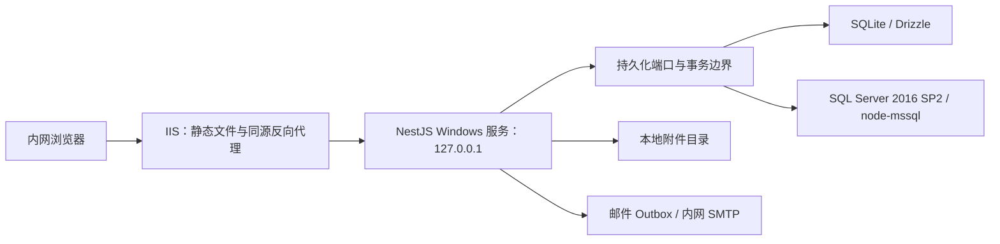

# FlowPilot 正式后端实现设计决策

> 文档状态：已确认的首版实现基线  
> 整理日期：2026-08-20  
> 适用范围：NestJS 正式后端、SQLite、Microsoft SQL Server 2016 SP2、本地附件目录和内网部署

## 1. 文档定位

本文档汇总正式后端实施讨论中已经确认的约束、选择原因和实现建议，用于指导数据库建模、接口实现、附件存储、部署和验收。

- 业务需求以 [`REQUIREMENTS.md`](../REQUIREMENTS.md) 为最高优先级；两者冲突时以需求文档为准。
- REST 接口结构以 [`flowpilot-rest-api.openapi.yaml`](./flowpilot-rest-api.openapi.yaml) 为契约来源。
- 当前前端 Mock 行为见 [`MOCK_REST_API.md`](./MOCK_REST_API.md)；Mock Bearer 身份、浏览器持久化和模拟任务不能直接搬到生产环境。
- 本文中的逻辑表名和配置键是实施基线，可以在不改变语义和验收结果的前提下调整命名。

## 2. 已确认的总体边界

- 正式后端采用 TypeScript、NestJS 和 REST API，与前端放在同一个 pnpm workspace 中。
- 首版必须同时实现 SQLite 和 Microsoft SQL Server 2016 SP2，修改部署配置并重启服务即可切换，不修改业务代码、不重新构建。
- SQLite 使用稳定版 Drizzle；SQL Server 使用稳定版 `node-mssql`，不依赖预发布状态的 Drizzle MSSQL 驱动。
- 系统部署在公司内网的 Windows 服务器上：IIS 托管前端静态文件，并把同源 `/api/*` 反向代理到 Windows 服务形式运行的 NestJS。
- 首版只运行一个 API 实例。预计每年新增流程实例不超过 2 万，附件总量不超过 500 GB。
- 附件正文保存在服务器本地目录；数据库只保存元数据、相对存储键和业务引用。
- 当前正式环境使用 HTTP；这是既定兼容条件，但必须明确其缺少传输加密的风险，并保留以后启用 HTTPS 的配置能力。
- SQL Server 2016 SP2 已超出官方支持周期。兼容它是部署约束，不代表安全推荐；部署方需要提供补偿性控制和升级计划。



## 3. 流程定义、版本和动态字段

### 3.1 V1 与 V2 的保存原则

假设流程定义 V1 有属性 A、B、C，V2 有 A、E、F：

- 数据库不为动态业务属性创建 A、B、C、E、F 六个固定物理列。
- V1 保存一份包含 A、B、C 的完整版本快照；V2 另存一份包含 A、E、F 的完整版本快照。
- V2 发布不会覆盖 V1。已经发起的实例永久关联发起时的版本 ID，并继续按 V1 解释和展示。
- 如果 V2 的 A 与 V1 的 A 是同一个业务字段，必须沿用相同的稳定字段 ID；仅修改名称不改变字段 ID。
- 删除字段后重新创建同名字段视为新字段，必须生成新的字段 ID，不能自动映射旧值。
- 流程名称、状态、类型、版本号、发布时间、创建人等稳定且高频查询的系统属性使用普通关系列；动态表单结构和值使用 JSON。

示意：

```json
{
  "version": 1,
  "fields": [
    { "id": "field-a", "name": "A", "type": "text" },
    { "id": "field-b", "name": "B", "type": "number" },
    { "id": "field-c", "name": "C", "type": "date" }
  ]
}
```

```json
{
  "version": 2,
  "fields": [
    { "id": "field-a", "name": "A", "type": "text" },
    { "id": "field-e", "name": "E", "type": "select" },
    { "id": "field-f", "name": "F", "type": "boolean" }
  ]
}
```

### 3.2 推荐的逻辑模型

下列名称是实现示意，不是要求逐字采用的最终 DDL：

| 逻辑表 | 主要职责 |
| --- | --- |
| `workflow_definitions` | 流程版本家族、名称、类型、当前发布版本指针和状态 |
| `workflow_definition_versions` | 完整、自包含的表单和拓扑 JSON 快照、正式版本号、校验状态、revision |
| `workflow_instances` | 实例公共属性、锁定版本 ID、当前最新表单值 JSON、状态和轮次 |
| `instance_field_values` | 允许查询、排序、列表展示或导出的动态标量字段类型化投影 |
| `workflow_tasks` | 节点任务、轮次、责任人、实际处理人、状态和处理结果 |
| `workflow_events` | 不可变的业务时间线和字段修改元数据 |

每个正式流程版本必须保存完整快照，不能只保存相对上一版本的差异。这样历史实例在当前流程取消发布、字段删除或节点调整后仍可解释。

### 3.3 JSON 与查询投影的组合

所有动态数据只放在 JSON 中，适合完整保存和按版本渲染，但不适合作为全部列表、范围筛选、排序和跨版本统计的唯一查询来源。因此采用“JSON 主数据 + 类型化投影”的组合：

- JSON 是表单结构和实例最新业务值的完整事实来源。
- 只有配置为查询条件、列表字段或 Excel 导出字段的动态标量值进入投影表。
- 投影至少包含流程定义 ID、版本 ID、实例 ID、稳定字段 ID、值类型，以及互斥的文本、数字、日期时间、布尔和选项标识值列。
- 表格字段如果需要按列查询，应保存稳定表格字段 ID、列 ID，并按需要增加行标识；不能把整张表格序列化后再做字符串比较。
- 数字范围使用数字列，日期范围使用日期时间列，布尔和稳定选项标识使用对应类型列，不能统一转成文本后比较。
- JSON 最新值与投影必须在同一个数据库事务中更新。任一部分失败时整体回滚。
- 需要提供幂等的投影校验和重建命令，以 JSON 主数据为来源恢复投影。

推荐索引围绕实际查询建立，例如：

- `(workflow_definition_id, field_id, text_value)`；
- `(workflow_definition_id, field_id, number_value)`；
- `(workflow_definition_id, field_id, datetime_value)`；
- `(instance_id, field_id)` 唯一性或等价约束。

不要为每一个动态字段修改数据库结构，也不要让业务服务拼接动态 JSON 路径 SQL。

### 3.4 历史值和修改记录

- 实例保存当前最新值，历史事件只记录发生修改的稳定字段 ID、当时字段名称、操作人、时间、节点、轮次和说明。
- 不保存、展示或打印字段修改前值、修改后值、旧附件名称和自由协作回复的旧正文。
- 流程定义版本快照属于配置历史，不等同于实例字段修改历史，必须永久保留。

## 4. SQLite 与 SQL Server 适配

### 4.1 分层边界

领域服务只能依赖统一接口，例如：

- `PersistenceUnitOfWork`；
- `WorkflowDefinitionRepository`；
- `WorkflowInstanceRepository`；
- `TaskRepository`；
- `AttachmentRepository`；
- `SessionRepository`；
- `OutboxRepository`。

领域层不得导入 Drizzle 表、`node-mssql` 连接或数据库驱动类型，也不得出现 `if (provider === "mssql")` 一类数据库分支。锁、编号分配和任务领取等方言差异封装在适配器内部。

数据库切换的核心配置示意：

```dotenv
DATABASE_PROVIDER=sqlite
SQLITE_FILE=D:\FlowPilot\data\flowpilot.db
```

```dotenv
DATABASE_PROVIDER=mssql
MSSQL_SERVER=sqlserver.internal
MSSQL_PORT=1433
MSSQL_DATABASE=FlowPilot
MSSQL_USER=flowpilot_app
MSSQL_PASSWORD=由部署密钥提供
MSSQL_ENCRYPT=按内网 SQL Server 配置确定
MSSQL_TRUST_SERVER_CERTIFICATE=按部署环境确定
```

- 应用启动时校验当前 provider 所需配置，禁止同时拼接两套连接逻辑。
- 密码等秘密不得提交到仓库；示例配置只能提供占位符。
- 切换数据库后重启服务即可，附件根目录、接口地址和领域行为保持不变。

### 4.2 跨数据库类型映射

| 领域类型 | SQLite | SQL Server 2016 SP2 |
| --- | --- | --- |
| UUID/稳定 ID | `text` | `nvarchar(36)` 或约定的 `uniqueidentifier` |
| 布尔值 | 受约束的整数 | `bit` |
| UTC 时间 | 统一格式文本或驱动映射 | `datetime2` |
| JSON | `text` | `nvarchar(max)` + `ISJSON` 约束 |
| 枚举 | 受约束文本 | 受约束 `nvarchar` |
| revision | `integer` | `int` |

领域层统一使用 UTC 时间、稳定字符串 ID、布尔值和整数 revision。乐观锁统一使用 revision，不直接暴露 SQL Server `rowversion`。

### 4.3 事务与并发差异

- SQLite 写事务通过应用级队列和 `BEGIN IMMEDIATE` 串行执行，数据库文件必须位于 NestJS 同机本地磁盘，不能放在 NAS。
- SQL Server 使用连接池和显式事务；编号分配、版本发布和任务抢占按场景使用 `SERIALIZABLE`、`UPDLOCK/HOLDLOCK` 或等价机制。
- 数据库事务中不得发送 SMTP、移动附件正文或调用其他外部服务。
- 发起实例、提交审核、重新提交和发布版本等命令必须保持领域原子性。
- 写接口使用幂等键防止网络重试造成重复实例或重复决定；可编辑资源使用整数 revision 与 `ETag/If-Match` 处理并发覆盖。

### 4.4 迁移脚本和数据库切换

- 每一个逻辑结构版本同时提供 SQLite 与 SQL Server 两份迁移脚本，并使用相同逻辑编号。
- 统一迁移命令根据 `DATABASE_PROVIDER` 选择方言；应用启动只检查结构版本，落后时拒绝就绪，不自动执行 DDL。
- 两个适配器必须执行同一组仓储契约测试和核心业务场景测试，不能只验证能够连接数据库。
- 提供独立的 SQLite 到 SQL Server 停机迁移工具，不在服务运行时做在线双写。
- 目标 SQL Server 必须提前迁移到正确结构且业务表为空。
- 迁移保留稳定 ID、版本号、revision、编号计数、幂等记录、审计、Outbox、附件元数据和相对存储键。
- 切换前输出逐表数量、关键聚合、外键、投影一致性和附件 SHA-256/存在性校验报告。

## 5. SQL Server 2016 SP2 的 JSON 影响

SQL Server 2016 SP2 在数据库兼容级别 130 下可以使用 `ISJSON`、`JSON_VALUE`、`JSON_QUERY` 和 `OPENJSON`，但存在以下限制：

- 没有原生 JSON 数据类型，JSON 实际保存为 `nvarchar(max)`。
- 没有适合任意动态路径的通用 JSON 索引。
- `JSON_VALUE` 返回标量文本时存在 4000 字符限制，不适合作为通用字段读取机制。
- 固定 JSON 路径可以通过计算列再建立索引，但流程字段是动态配置，按字段不断增加计算列会重新制造“每个字段一个数据库列”的问题。
- 直接使用 `OPENJSON` 扫描大量实例会增加查询成本，也会让 SQLite 与 SQL Server 产生明显不同的查询实现。

因此：

- `ISJSON` 用于数据库约束；其他 JSON 函数只用于诊断、校验或受控迁移。
- 正式列表、范围筛选、排序、跨版本查询和 Excel 数据集读取类型化投影，不直接扫描 JSON。
- 业务查询接口不暴露 SQL Server JSON 路径，不把数据库方言泄漏到领域层。

## 6. 本地附件目录实现

### 6.1 数据与文件职责

数据库保存：

- 附件 ID；
- 原始文件名；
- 服务器生成的相对存储键；
- 文件大小；
- 客户端声明和服务端识别的内容类型；
- SHA-256；
- 上传人和上传时间；
- 生命周期状态、失败原因和清理时间；
- 业务引用关系。

文件系统保存附件正文。数据库不得保存附件二进制正文或客户端可访问的绝对路径。

建议目录：

```text
ATTACHMENT_ROOT/
├─ .incoming/
│  └─ {attachmentId}.part
└─ objects/
   └─ {ID分片}/
      └─ {attachmentId}
```

- 临时目录和对象目录必须位于同一个磁盘卷，以便完成上传后使用原子重命名。
- 物理文件名只使用服务端生成的附件 ID，不使用原始文件名。
- 数据库只保存相对存储键。解析后必须校验规范化的最终路径仍位于附件根目录内，阻止路径穿越。

### 6.2 两阶段模型与状态

附件采用“先暂存、后引用”，避免把长时间文件上传放进数据库事务：

1. 服务端生成附件 ID 和 `.part` 路径。
2. 以流式 `multipart/form-data` 写入临时文件，同时计算大小和 SHA-256，不把整个文件读入 Node.js 内存。
3. 校验扩展名、实际内容类型、大小和字段配置；失败时标记失败并清理临时文件。
4. 关闭文件句柄后原子移动到 `objects`，元数据进入 `staged`。
5. 流程保存、发起、重新提交或审核决定在数据库事务中创建附件引用，并把附件转为已引用状态。
6. 替换附件时创建新附件 ID，绝不覆盖旧物理对象。旧对象确认没有任何引用后进入 `cleanup-pending`。

可采用 `uploading → staged → active → cleanup-pending → deleted`，并补充 `failed` 状态。文件系统和数据库无法组成一个原子事务，所以必须依靠明确状态、幂等命令和后台补偿清理，而不是假设两边永远同步成功。

### 6.3 清理与完整性

- `staged` 且 24 小时未被引用的附件进入清理。
- 被替换且确认无业务引用的附件进入 `cleanup-pending`，保留 24 小时后删除。
- 清理前再次查询引用；任何仍被引用的文件不得物理删除。
- 删除失败保存原因并重试，不能先删元数据导致孤立引用不可解释。
- SHA-256 用于完整性校验、迁移核对和内容 ETag，不用于附件内容去重。
- 首版不提供分片上传、断点续传、内容去重或病毒扫描状态机。
- 上传前检查磁盘空间，默认至少保留 2 GiB，可配置；不足时返回 HTTP `507`，健康状态显示降级。

### 6.4 下载和预览

- 每次查看、下载和预览都重新校验流程可见范围及附件字段权限，不能依靠不可猜测 URL 代替鉴权。
- 内容接口支持单区间 HTTP Range：合法范围返回 `206`，非法范围返回 `416`；首版不支持多区间。
- 只有服务端实际识别为 PDF 的文件允许 `inline`，其他文件强制下载。
- 下载响应使用经过处理的原始文件名；响应头必须防止换行和头部注入。

## 7. 身份、会话和接口安全

- 正式密码使用 Argon2id 散列，不保存或记录明文。
- 业务需求仍允许最短 1 个字符的密码，因此需要通过登录速率限制降低在线猜测风险；这不等于强密码策略。
- 登录失败不锁定账号，同时按“账号 + 来源 IP”和来源 IP 总量做临时限制，超限返回 `429`。
- 正式后端使用服务端不透明会话。Cookie 只保存高强度随机令牌，数据库只保存令牌散列。
- 会话闲置 8 小时失效，绝对有效期 24 小时。用户停用或密码重置后，全部现存会话立即失效。
- Cookie 设置 `HttpOnly`、`SameSite=Strict`；当前 HTTP 环境关闭 `Secure`，以后启用 HTTPS 时通过配置打开。
- 正式 API 只接受同源浏览器调用，关闭 CORS；所有修改状态的请求校验 `Origin` 或 `Referer`。
- 首版不提供 API Key、服务账号或第三方集成认证。
- 超级管理员初始密码从部署密钥读取并只散列写入一次；页面和业务 API 不能修改该账号，停机状态下可用专用离线命令重置。

## 8. API 契约、错误和导出

- OpenAPI 3.1 是正式接口的唯一事实来源，用来生成共享 TypeScript 类型、请求校验器和前端客户端；生成物不得手工编辑。
- NestJS 实际响应需要通过契约测试，避免实现和 OpenAPI 漂移。
- 错误使用 Problem Details 风格，包含稳定业务错误码和 traceId，不把数据库异常或绝对路径直接返回前端。
- 写命令支持 `Idempotency-Key`；资源更新支持 `ETag/If-Match` 和 revision。
- Mock 环境的 Bearer 身份只属于原型，正式接口改用服务端会话 Cookie。
- Excel 文件仍由浏览器使用 ExcelJS 生成。后端只返回经过页面权限、数据范围、字段权限和全部查询条件过滤的数据集；单次最多 10000 行，不生成或暂存 `.xlsx`。

## 9. 事务、Outbox 和后台任务

### 9.1 核心事务

- 发起实例：锁定版本、分配编号、写入表单 JSON 与投影、展开任务、更新计数和时间线一次提交。
- 首次审批/确认：校验任务和字段白名单，写入最新表单与投影、处理结果、实际处理人、后续任务和实例状态一次提交。
- 重新提交：新轮次、最新值、附件引用、任务重建和时间线一次提交。
- 邮件发送和文件 I/O 不进入上述数据库事务。

### 9.2 Outbox

- 需要发送邮件时，在业务事务中只写 Outbox 记录；事务提交后由后台任务调用 SMTP。
- 首次失败后按 1、5、15、60、360 分钟重试，累计 6 次仍失败时进入死信。
- 管理员可以手工安排死信重试；SMTP 故障不回滚已提交业务事务。

### 9.3 进程内调度

- 邮件、附件清理、过期会话和幂等记录清理由 API 进程内调度器执行。
- 调度任务使用数据库状态和带超时的租约领取，服务重启后可以恢复卡住的处理中任务，不能只依赖内存计时器。
- 当前只有一个 API 实例，但租约设计仍需防止任务重入和同一任务重复处理。

## 10. 数据保留、日志和备份

- 流程定义版本、实例、审批结果、自由协作最新内容和不可变业务审计永久保留，不提供实例自动删除、人工删除或归档。
- 技术日志默认保留 30 天；已发送 Outbox 记录保留 180 天；幂等记录和已过期会话保留 7 天。
- 死信在问题解决或重试成功前不得自动清理。
- 结构化日志包含 traceId，但不得记录密码、会话令牌、完整表单值、附件正文、数据库密码或其他秘密。
- 首版不提供应用内自动定时备份。
- 人工备份和恢复只在 Windows 服务停止后执行。SQLite 数据库、附件清单和 SHA-256 一起校验，管理员负责复制到其他位置。
- SQL Server 模式的数据库备份由 DBA 负责；应用继续提供附件清单及完整性校验。

## 11. 部署与健康检查

- NestJS 只监听 `127.0.0.1`，由 IIS 提供内网入口。
- Windows 服务使用独立低权限账号。程序目录只读，数据库、附件和日志目录分别授予最小读写权限。
- SQLite 文件、附件和日志放在固定持久化目录，不放进代码发布目录。
- 提供存活、就绪和受权限保护的详细健康接口。
- 数据库不可用或结构版本落后时不就绪；磁盘不足、附件清理失败或邮件死信显示降级。
- 升级允许计划停机：停止服务、人工备份、执行当前方言迁移、启动服务、检查健康状态。
- 正式数据库首次初始化只创建超级管理员、内置角色权限、必要字典和结构版本，不创建演示流程、实例、用户或附件。

## 12. 建议实施顺序

1. 固化 OpenAPI、统一 ID、时间、错误、revision 和幂等语义。
2. 建立 NestJS 模块边界、领域仓储接口和 `PersistenceUnitOfWork`。
3. 定义逻辑数据模型，同时编写 SQLite 与 SQL Server 迁移。
4. 先完成 SQLite 适配器和仓储契约测试，再用同一测试集完成 SQL Server 适配器。
5. 实现服务端会话、权限和数据范围校验。
6. 实现流程定义版本、实例、任务、投影和事务命令。
7. 实现本地附件暂存、引用、下载、清理和完整性检查。
8. 实现 Outbox、后台租约任务、健康检查和保留清理。
9. 实现 SQLite 到 SQL Server 停机迁移工具及校验报告。
10. 在两种数据库上运行相同的端到端业务场景和故障恢复场景。

## 13. 首版验收重点

- 仅修改数据库配置并重启，同一构建产物可以在 SQLite 和 SQL Server 2016 SP2 上运行。
- 两个数据库通过相同的流程发布、发起、并行审批、驳回重提、重复修改、自由协作、附件和导出测试。
- V1 的 A/B/C 实例和 V2 的 A/E/F 实例可以同时存在，详情按锁定版本展示，查询字段按当前规则投影。
- JSON 与投影发生模拟故障时不会出现一边成功、一边失败；投影可以校验和重建。
- 附件上传中断、业务提交失败、替换、过期和删除失败都能通过状态和后台任务恢复，不产生越权下载。
- 数据库结构落后时服务拒绝就绪；邮件或附件清理异常只形成可见降级，不破坏已提交业务事务。
- SQLite 到 SQL Server 迁移后，稳定 ID、版本、任务、审计、附件引用、投影和数量校验一致。

## 14. 首版明确不做

- 多 API 实例、高可用和零停机升级；
- PostgreSQL 和分布式对象存储；
- 在线双写或不停机数据库迁移；
- 附件分片、断点续传、内容去重和病毒扫描状态机；
- 应用内自动定时备份；
- 实例删除、自动归档和历史字段值回放；
- 依赖 SQL Server 动态 JSON 扫描实现核心业务查询。
